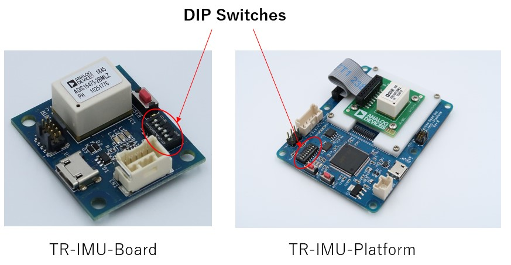

## ADI_IMU_TR_Driver_ROS1

This repository is the ROS1 driver for ADI_IMU.

[Click here](https://github.com/technoroad/ADI_IMU_TR_Driver_ROS2) for ROS2 version.

### Overview
“TR-IMU1647X” is Analog Devices IMU sensor that can be easily connected to ROS and output high-precision attitude angles.

<div align="center">
  
  
</div>

### Demo movie
Click the thumbnail to open the youtube video.  
  [](https://www.youtube.com/watch?v=2emmX7TSa1U "Adi-IMU-TR")

### Compatible sensors
This software is compatible with these sensors.
- TR-IMU16470
- TR-IMU16475-2
- TR-IMU-Platform

### Operating environment
This software has been confirmed to work on the following OS and ROS versions.
- Ubuntu 16.04 LTS + ros1 kinetic (This is not maintained. If you use it, use the kinetic branch.)  
- Ubuntu 18.04 LTS + ros1 melodic  
- Ubuntu 20.04 LTS + ros1 noetic  

### How to use
#### Port setting
Add the user to the dialout group to use the USB port as the login user. (If you have already added it, skip this item)  
Execute the following command.
```
$ sudo addgroup `whoami` dialout
```
Then, log out and log in again to reflect the settings.

#### DIP switch settings
First, set the DIP switch.
- For TR-IMU16470 or TR-IMU16475-2, turn on No. 1 and No. 4 and turn off all the rest.
- For TR-IMU-Platform, turn on No. 1 and No. 5 and turn off all the rest.

<div align="center">
  
</div>

After setting the switch, connect the sensor via USB.

#### Install
Go to your package directory and clone.
```
$ cd [your packages directory]
$ git clone --recursive https://github.com/technoroad/ADI_IMU_TR_Driver_ROS1
```

Then resolve dependencies.
```
$ cd [your workspace directory]
$ rosdep update
$ rosdep install --from-paths src --ignore-src --rosdistro ${ROS_DISTRO} -y
```

#### Build
Go to your workspace directory and run the build command.  
```
$ cd [your workspace directory]
$ catkin_make -DCMAKE_BUILD_TYPE=Release
```

Then set the path.
```
$ source devel/setup.bash
```

#### Run
This software has two execution modes.
- Imu board(On-board angle estimation) + Rviz vizualization
- Imu board(Acceleration and gyro output) + imu_filter_madgwick + Rviz vizualization

The respective execution methods are shown below.

##### Run imu board(On-board angle estimation) + Rviz vizualization
Execute the following command.
```
$ roslaunch adi_imu_tr_driver_ros1 adis_rcv_csv.launch mode:=Attitude device:=/dev/ttyACM0
```

You can see the model of ADIS16470 breakout board in rviz panel.  

<div align="center">
  
</div>

##### Run imu board(Acceleration and gyro output) + imu_filter_madgwick + Rviz vizualization
Execute the following command.
```
$ roslaunch adi_imu_tr_driver_ros1 adis_rcv_csv.launch mode:=Register device:=/dev/ttyACM0 with_filter:=true
```

You can see the model of ADIS16470 breakout board in rviz panel.  

<div align="center">
  
</div>

### Topics
This software outputs the following topics.

- /imu/data_raw (sensor_msgs/Imu)

  IMU raw output. It contains angular velocities and linear
  accelerations. The orientation is always unit quaternion.  
  To view this data, execute sensor in the Register mode.  
  example:

```
$ rostopic echo /imu/data_raw
・・・
angular_velocity:
  x: -0.0116995596098
  y: -0.00314657808936
  z: 0.000579557116093
angular_velocity_covariance: [0.0, 0.0, 0.0, 0.0, 0.0, 0.0, 0.0, 0.0, 0.0]
linear_acceleration:
  x: 0.302349234658
  y: -0.303755252655
  z: 9.87837325989
linear_acceleration_covariance: [0.0, 0.0, 0.0, 0.0, 0.0, 0.0, 0.0, 0.0, 0.0]
・・・
```

- /diagnostics (diagnostic_msgs/DiagnosticArray)

  Sensor state output.  
  example:

```
$ rostopic echo /diagnostics
・・・
header:
  seq: 80
  stamp:
    secs: 1587104853
    nsecs: 921894057
  frame_id: ''
status:
  -
    level: 0
    name: "adis_rcv_csv_node: imu"
    message: "OK"
    hardware_id: "ADIS16470"
    values: []
・・・
```

### Common operations
#### Calibration(Available only in Attitude mode)
How to update the calibration parameters.
1. Start the sensor in attitude mode using the following command.
```
$ roslaunch adi_imu_tr_driver_ros1 adis_rcv_csv.launch mode:=Attitude device:=/dev/ttyACM0
```
2. Leave the sensor stationary for 120 seconds. (Parameters are calculated automatically)
3. Update the parameters with the following command.

```
$ rosservice call /imu/cmd_srv "cmd: 'START_BIAS_CORRECTION'
args:
- ''"
```

#### Reset attitued(Available only in Attitude mode)
How to reset the attitude angle.
1. Start the sensor in attitude mode using the following command.
```
$ roslaunch adi_imu_tr_driver_ros1 adis_rcv_csv.launch mode:=Attitude device:=/dev/ttyACM0
```
2. Leave the sensor stationary for 120 seconds. (Parameters are calculated automatically)
3. Update the parameters with the following command.

```
$ rosservice call /imu/cmd_srv "cmd: 'RESET_FILTER'
args:
- ''"
```

#### Get error code
How to get error code
1. Get error code from sensor.
```
$ rosservice call /imu/cmd_srv "cmd: 'error'
args:
- ''"
```
2. Get error code description.
```
$ rosservice call /imu/cmd_srv "cmd: 'help'
args:
- 'The reply is printed to the main terminal.If it is not output,please check the log level of launch file.'"
```
※ Sending the help command stops data transmission from IMU.Send the start command to resume.
```
$ rosservice call /imu/cmd_srv "cmd: 'start'
args:
- ''"
```

### License
MIT
